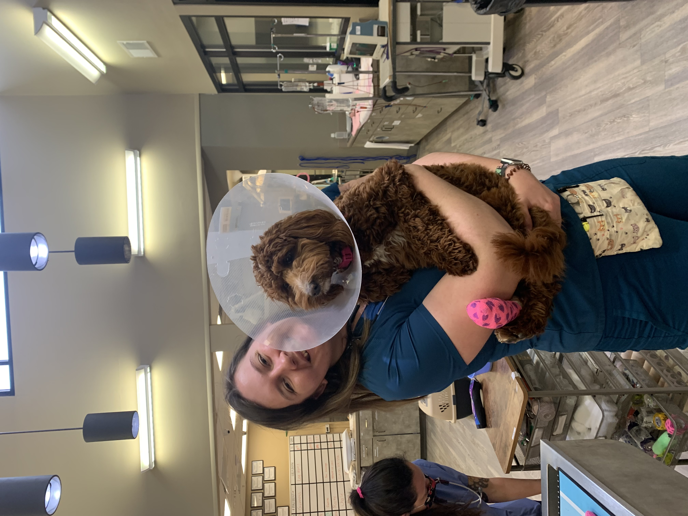

LILLY BAER
========

#### [Senior Geography Student](https://geo.appstate.edu/)

#### Boone, North Carolina, USA

Expertise
-----
climate change mitigation, usability of geographic information, cartogrpahy, geovisualization, communication, geographic infromation science, animal conservation

Education
-----
Bachelor's of Science, General Geography
GIS certification
Minor, Sustainable Development

Experience
----
Environmental Programs Intern, Henderson County Government, *Aug 2022-Dec 2022*
Front of House Team Member, Booneshine Brewing Co., *Oct 2022-present*
Emergency Veterinary Nurse, Western Carolina Regional Animal Hospital, *Jan 2021-Aug 2022*
Bartender, Guidon Brewing Co., *Mar 2022-Aug 2022*

